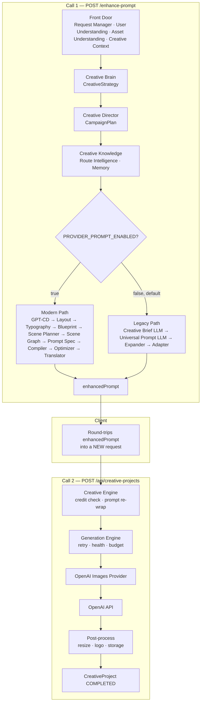
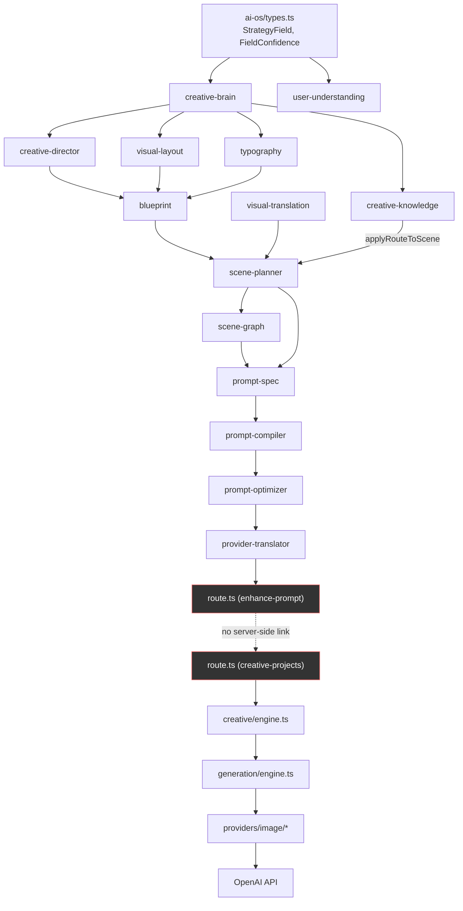
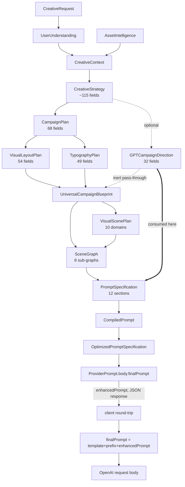
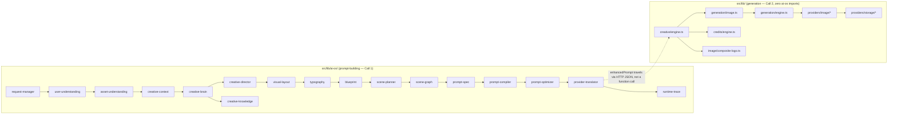

# Image Generation Pipeline — Complete Architecture Reference

**Scope.** Everything that happens between a user's raw idea and a real `POST https://api.openai.com/v1/images/generations` call, verified directly against source in this repository (`c:\Users\ASUS\Desktop\Elevatex Ai`) on 2026-07-07. Every claim below traces to a real file, function, or type — nothing in this document is inferred or assumed. Where source comments were found to be stale or incorrect, that is called out explicitly rather than repeated.

**This is a pure documentation artifact.** No application code was modified to produce it.

---

## Before anything else: the one fact that reframes this whole document

**There is no single pipeline.** There are two independent HTTP round-trips with no server-side link between them:

1. **`POST /api/creative-projects/enhance-prompt`** — builds a prompt string (`enhancedPrompt`) from a raw idea. Returns it as JSON. Touches no credits, no database project row, no image provider.
2. **`POST /api/creative-projects`** — a *separate* request. The client must take the `enhancedPrompt` string from step 1 and place it into this request's `prompt` field itself. Nothing on the server ties the two calls together — no shared token, no session-stored draft. This route is what actually spends credits and calls OpenAI.

And even then, the string this second route sends to OpenAI is **not** `enhancedPrompt` verbatim — `src/lib/creative/engine.ts` wraps it one more time:
```ts
const finalPrompt = [tool.promptTemplate, stylePrefix, input.prompt].filter(Boolean).join(" ");
```
`tool.promptTemplate` is an admin-editable per-tool DB column; `stylePrefix` is a static per-preset prefix. So the string OpenAI actually receives is `{admin template} {preset style prefix} {enhancedPrompt}`.

Parts 1–2 below cover call 1 in depth (this is where almost all of the "intelligence" lives) and then call 2 (where the actual API request happens).

---

## PART 1 — High-Level Execution Flow

### Call 1 — `POST /api/creative-projects/enhance-prompt` (builds the prompt)

```
User Request (raw idea text)
        ↓
API Route — src/app/api/creative-projects/enhance-prompt/route.ts
        ↓
requireSession()                                   [auth]
        ↓
buildEnhancePromptRequest()                        [Request Manager — rate limit, Zod validation, prompt-injection sanitizer]
        ↓ CreativeRequest
analyzeUserRequest()                                [User Understanding — pure, sync, keyword-based]
        ↓ UserUnderstanding                          (runs in parallel with the next box + 2 config-flag reads)
resolveAssetIntelligence()                          [Asset Understanding — reference image vision LLM, brand kit, logo]
        ↓ AssetIntelligence
buildCreativeContext()                              [Creative Context — pure aggregation]
        ↓ CreativeContext
buildCreativeStrategy()                             [Creative Brain — pure rule engine, ~110-120 reasoned fields]
        ↓ CreativeStrategy
buildCampaignPlan()                                 [Creative Director (deterministic) — 70 fields]
        ↓ CampaignPlan
buildRouteContext() + evaluateIntelligence()        [Creative Knowledge / Route Intelligence — selects 1 of 59 hardcoded routes]
        ↓ RouteIntelligenceResult
── PIPELINE BRANCH on PROVIDER_PROMPT_ENABLED (admin flag, default false) ──
   ┌─ MODERN PATH (providerPromptEnabled = true) ─────────────────────────┐
   │ runGPTCreativeDirector()      [GPT Creative Director — REAL LLM #1] │
   │        ↓ GPTCampaignDirection | null                                │
   │ buildVisualLayoutPlan()       [Visual Layout — 56 fields]           │
   │        ↓ VisualLayoutPlan                                           │
   │ buildTypographyPlan()         [Typography — 51 fields]              │
   │        ↓ TypographyPlan                                             │
   │ assembleBlueprint()           [Blueprint]                           │
   │        ↓ UniversalCampaignBlueprint                                 │
   │ buildVisualScenePlan()        [Scene Planner — 10 domains]          │
   │        ↓ VisualScenePlan                                            │
   │ applyRouteToScene()           [Route Scene Enrichment]              │
   │        ↓ enrichedScene                                              │
   │ buildSceneGraph()             [Scene Graph — 8 sub-graphs]          │
   │        ↓ SceneGraph                                                 │
   │ buildPromptSpecification()    [Prompt Specification — 12 sections] │
   │        ↓ PromptSpecification         (gptDirection consumed HERE)   │
   │ compileToVisualLanguage()     [Prompt Visual Compiler]              │
   │  + applyCompiledPrompt()      ↓ CompiledPrompt + updated spec       │
   │ optimizePromptSpecification() [Prompt Optimizer]                    │
   │        ↓ OptimizedPromptSpecification                               │
   │ translateForProvider()        [Provider Translator]                 │
   │        ↓ ProviderPrompt.body.finalPrompt = enhancedPrompt           │
   └───────────────────────────────────────────────────────────────────┘
   ┌─ LEGACY PATH (providerPromptEnabled = false — CURRENT DEFAULT) ──────┐
   │ buildCreativeBrief()          [LLM call — Creative Brief]           │
   │ buildUniversalPromptFromIdea()[LLM call — Universal Prompt]         │
   │ expandUniversalPrompt() + resolvePromptAdapter() + cleanEnhancedPrompt()│
   │        ↓ enhancedPrompt (legacy-shaped)                              │
   └───────────────────────────────────────────────────────────────────┘
        ↓
Memory save (fire-and-forget)                       [Creative Memory — in-memory only, not DB-backed]
        ↓
Final API Response — { enhancedPrompt, ...debug fields... } as JSON to the client
```

**Important:** `PROVIDER_PROMPT_ENABLED` defaults to `false` in `CONFIG_REGISTRY` (`src/lib/admin/config.ts`), meaning **the legacy 2-LLM-call path is the current default**, not the modern 13-phase path. The modern path only runs once an admin explicitly enables it in `/admin/prompt-lab`. Both paths share Phases 1–5 (Request Manager → Creative Brain → Campaign Plan → Route Intelligence) as a common foundation before branching.

### Call 2 — `POST /api/creative-projects` (spends credits, calls OpenAI)

```
Client sends { prompt: enhancedPrompt, kind, presetKey, referenceAssetId?, logoAssetId?, ... }
        ↓
API Route — src/app/api/creative-projects/route.ts
        ↓
requireSession() + checkRateLimit("creative_create", 20/hr) + Zod validation
        ↓
generateCreativeImage()                             [src/lib/creative/engine.ts]
        ↓
  creditCheck → preset resolve → asset ownership checks → negative-prompt merge
        ↓
  finalPrompt = [tool.promptTemplate, stylePrefix, input.prompt].join(" ")   ← SECOND wrapping layer
        ↓
  CreativeProject DB row created (status: DRAFT)
        ↓
generateImage()                                      [src/lib/generation/image.ts — Generation Engine entry]
        ↓
  listEnabledProviderConfigs("IMAGE")                [DB-backed priority + failover chain]
        ↓
runGeneration()                                      [src/lib/generation/engine.ts — real retry/health/budget engine]
        ↓
OpenAIImagesProvider.generate()                      [src/lib/providers/image/openai-images.provider.ts]
        ↓
  POST https://api.openai.com/v1/images/generations   ← THE REAL EXTERNAL CALL
  { model: "gpt-image-1.5", prompt: finalPrompt, size, quality: "high", n: 1 }
        ↓
  Image Response (base64 → data: URI)
        ↓
  toBuffer() → resize/normalize (sharp) → composite logo (if present) → storage.upload() (S3)
        ↓
  DB transaction: recordAsset() + consumeCredits() (the real charge point) + project.update(COMPLETED)
        ↓
Final API Response — { project: { ...fields, resultUrl } } as JSON, HTTP 201
```

---

## PART 2 — File Trace

Every module, in real execution order. "Flags" only lists flags the module itself reads (not flags read by its caller). "Fallbacks" describes behavior when the module can't determine a value — every module in this pipeline is designed to degrade to `"unknown"` rather than throw, except where noted.

### 2.1 — Request Manager

| | |
|---|---|
| Purpose | Validate, rate-limit, and sanitize the raw HTTP request into a typed `CreativeRequest` |
| Entry file | `src/lib/ai-os/request-manager/index.ts` (the entire module — no sub-files) |
| Entry function | `buildEnhancePromptRequest(rawBody: unknown, userId: string): Promise<BuildRequestResult>` |
| Input | `unknown` (raw JSON body) + `userId` |
| Output | `{ ok: true; request: CreativeRequest } \| { ok: false; error: CreativeRequestError }` |
| Who calls it | `enhance-prompt/route.ts` only (production) |
| Who consumes it | Everything downstream reads `CreativeRequest` |
| Runtime flags | None directly (rate-limit *policy* is admin-configured via `RATE_LIMITS`, but read inside `checkRateLimit`, not here) |
| Fallbacks | If sanitization strips the entire idea (prompt-injection patterns matched every sentence), falls back to the literal string `"creative advertisement"` rather than empty text |
| Dependencies | `@/lib/validations/creative` (Zod schema), `@/lib/security/rate-limit` |

Order of operations: **rate limit check runs before validation** — `checkRateLimit("ai_assistant", userId)` (60 requests/hour, admin-configurable, shared with several unrelated video-script endpoints) fails fast before the body is even parsed. Then `enhanceCreativePromptSchema.parse(rawBody)` (Zod: `prompt` 1–500 chars, optional `kind`/`presetKey`/`referenceAssetId`/`logoAssetId`). Then `sanitizeIdea()` strips any sentence matching one of ~25 prompt-injection regex patterns (role-switching, "ignore previous instructions", jailbreak keywords, system-prompt exfiltration attempts).

### 2.2 — User Understanding

| | |
|---|---|
| Purpose | Extract ~28 intent/industry/audience signals from raw text — no reasoning, no marketing logic |
| Entry file | `src/lib/ai-os/user-understanding/engine.ts` |
| Entry function | `analyzeUserRequest(request: CreativeRequest): UserUnderstanding` — **synchronous**, not async |
| Input | `CreativeRequest` |
| Output | `UserUnderstanding` (28 top-level fields + 6 Phase-2 enrichment structures — full list in Part 3) |
| Who calls it | `enhance-prompt/route.ts`; also 3 admin/debug/benchmark routes that bypass Request Manager entirely and hand-build a minimal `CreativeRequest` |
| Who consumes it | Creative Context, Creative Brain (indirectly, via Creative Context) |
| Runtime flags | None |
| Fallbacks | Every detector has a deterministic `unknownField()` fallback (`confidence: "unknown"`) — the function never throws |
| Dependencies | None outside `../types` (confirmed zero `async`/`await`/`fetch`/`prisma` in the file) |

Detection is 100% keyword-list + word-boundary regex matching (`\bkeyword\b`, case-insensitive) — no ML/NLP library, no LLM call. Language detection is a single Devanagari-Unicode-range regex. Confidence score is a weighted sum across 10 fields (industry 22%, intent 18%, platform 12%, etc.).

### 2.3 — Asset Understanding

| | |
|---|---|
| Purpose | Resolve reference image, logo, and brand kit into structured intelligence |
| Entry file | `src/lib/ai-os/asset-understanding/engine.ts` |
| Entry function | `resolveAssetIntelligence(request: CreativeRequest, userId: string): Promise<AssetIntelligence>` |
| Input | `CreativeRequest`, `userId` |
| Output | `AssetIntelligence` (legacy `referenceAnalysis`/`brandContext`/`logoAssetId` + Phase-3 `reference`/`product`/`logo`/`brandKit`, ~48+ fields on `reference` alone) |
| Who calls it | `enhance-prompt/route.ts` only |
| Who consumes it | Creative Context, Creative Brain, Creative Director (GPT), Blueprint |
| Runtime flags | None |
| Fallbacks | Missing/not-owned `referenceAssetId` → throws `AssetNotFoundError` (the only hard failure). Missing/failed logo → soft-fails to `undefined`. No brand kit row → `undefined` |
| Dependencies | `analyzeReferenceImage` (real vision-LLM call via `generateScript(..., "design_intelligence_analysis")`), `analyzeBrandKit` (pure DB→field mapper, **zero LLM calls**), `analyzeLogo` |

Runs three resolutions in parallel (`Promise.all`). Reference-image analysis is cached: reuses a prior `AssetAnalysis` DB row only if it's both "meaningful" (has style/industry/mood) **and** carries a `_aiOsVersion` sentinel proving it was written by the current Phase-3 analyzer, not a stale Phase-1 shape. **Correction to a common assumption:** the live analyzer is `analyzeReferenceImage` (its own file, ~38 additional fields beyond the older shape), not `analyzeAssetForLibrary` — that older function still exists in `src/lib/design-intelligence/analyze-asset.ts` but has zero live call sites. `ProductImageIntelligence`/`analyzeProductImage` similarly exist fully implemented but are never invoked (`CreativeRequest` has no field that would trigger them) — an explicitly documented "future phase" stub.

### 2.4 — Creative Context

| | |
|---|---|
| Purpose | Pure aggregation of the three front-door outputs into one object |
| Entry file | `src/lib/ai-os/creative-context/builder.ts` |
| Entry functions | `buildCreativeContext(request, userUnderstanding, assetIntelligence, sessionContext): CreativeContext`; `buildPromptOsInput(context, presetLabel?): PromptOsContextInput` |
| Input | The three front-door outputs + `{ userId }` |
| Output | `CreativeContext { request, userUnderstanding, assetIntelligence, sessionContext, createdAt, projectContext?, memoryContext?, campaignBlueprint? }` — the last three are declared but never populated at any current call site |
| Who calls it | `enhance-prompt/route.ts` (both paths); `buildPromptOsInput` only inside the legacy branch |
| Who consumes it | Creative Brain |
| Runtime flags | None |
| Fallbacks | None — pure, total function |
| Dependencies | None |

**Naming collision to be aware of:** a second, unrelated `buildCreativeContext` exists in `src/lib/ai-os/creative-decision-engine/index.ts` — it takes a different input type and returns a formatted `string` (a GPT prompt-context block), not a `CreativeContext` object. Used only inside `creative-director/gpt-engine.ts`. Confirmed independently by two separate research passes — real trap for anyone searching the codebase by name alone.

### 2.5 — Creative Brain

| | |
|---|---|
| Purpose | The core rule-based intelligence engine — converts context into ~110-120 individually-reasoned marketing/creative decisions |
| Entry file | `src/lib/ai-os/creative-brain/engine.ts` (1,057 lines; 10 files, 2,860 lines total in the module) |
| Entry function | `buildCreativeStrategy(context: CreativeContext): CreativeStrategy` — pure, synchronous |
| Input | `CreativeContext` |
| Output | `CreativeStrategy` — 8 domains (marketing, audience, communication, creative, business, platform, visual, campaign) + 5 Phase-10 layers (experienceProfile, semanticWeights, luxuryProfile, heroDecision, creativeMatrix) + confidenceScore + unknownFields |
| Who calls it | `enhance-prompt/route.ts`; 3 admin/debug/benchmark routes; imported by nearly every downstream module's test suite as the shared foundation type |
| Who consumes it | Creative Director, Route Intelligence, Visual Layout, Typography, Blueprint, GPT Creative Director, Scene Planner (indirectly via Blueprint) |
| Runtime flags | None |
| Fallbacks | Every field defaults to `sf("unknown", "unknown", reason)` when no signal fires |
| Dependencies | None outside its own module's files — **confirmed zero imports of `creative-knowledge`** (see 2.6) |

Explicitly documented as rule-based, not LLM-based: *"Pure function — no LLM calls, no I/O, no side effects... Never generates prompts... Only reasons, classifies, and infers."* Five concrete mechanisms combine to produce every decision: (1) direct signal inheritance from `UserUnderstanding`, (2) static lookup tables keyed by industry/intent (`knowledge.ts`), (3) prioritized if/else cascades (e.g. luxury level: keyword scan → reference image → business type → industry-default floor, taking the max), (4) literal keyword scanning against word lists, (5) a weighted signal-arbitration step (`semantic-weight-engine.ts`) that scores 5 competing sources and picks a `dominantSignal`. A cross-field coherence guard (`validateVisualCoherence`) throws if the pipeline would ever produce an incoherent combination (e.g. `heroType="product"` with `humanPresence="hero"`).

Notable sub-files: `luxury-engine.ts` (4-tier priority cascade for luxury level), `creative-matrix.ts` (maps Experience × IndustryCluster × LuxuryLevel → hero type/archetype/emotional driver), `hero-decision-engine.ts` (final hero-subject arbitration via a big `Record<HeroType, Record<industryKey, string>>` table + 3-priority override chain), `hero-knowledge-graph.ts` (generates deterministic slug IDs for later memory/similarity use).

### 2.6 — Creative Knowledge (Route Intelligence + Memory)

| | |
|---|---|
| Purpose | Select one of 59 hardcoded "creative routes" per campaign, and record/compare past generations for diversity | 
| Entry files | `src/lib/ai-os/creative-knowledge/route-intelligence/{engine,generator,ranker,scorers,context-builder,route-scene-adapter}.ts`; `creative-memory/{fingerprint,entry-builder,in-memory-store}.ts` (132 files, ~15,100 lines total in the directory) |
| Entry functions | `buildRouteContext(...)`, `evaluateIntelligence(context, options?): RouteIntelligenceResult`, `applyRouteToScene(scene, route): VisualScenePlan`, `buildEmptyFingerprint(...)`, `buildMemoryEntry(...)` |
| Input | `CreativeStrategy`, `CampaignPlan`, `AssetIntelligence`, `rawIdea` |
| Output | `RouteIntelligenceResult { rankedCandidates, selected, resultQuality, ... }` |
| Who calls it | `enhance-prompt/route.ts` — the **only** production file that imports from `creative-knowledge` |
| Who consumes it | The route handler itself (feeds `applyRouteToScene` and the memory-save call) |
| Runtime flags | None (mode `"deterministic"` vs `"exploration"` is chosen by the route handler based on `isVariation`, not a config flag) |
| Fallbacks | Empty candidate pool → still returns a result with `resultQuality: "low"`, never throws |
| Dependencies | `creative-route-engine/route-registry.ts` (59 hardcoded `CreativeRoute` objects across 13 industries) |

**Confirmed sibling relationship, not nesting:** Creative Brain has zero imports of Creative Knowledge; Creative Knowledge imports exactly one *type* (`CreativeStrategy`) from Creative Brain, in one file. They are orchestrated as separate, sequential phases by the route handler — architecturally identical to how Creative Director/Visual Layout/Typography also consume `CreativeStrategy` as a plain argument.

**Verified maturity gaps (real, not hypothetical):**
- Of the 7 scorers in `scorers.ts`, **5 are literal stubs** that return a constant regardless of input (`scoreCommercial`→50, `scoreNovelty`→60, `scorePsychologyMatch`→50, `scoreAudienceMatch`→50, `scoreIndustryMatch`→50). Only `scoreConfidence` (completeness-based) and `scoreImageDiversity` (branches only on reference-image presence) have real logic.
- Both archetype registries (`archetype-registry/registry.ts` and `universal/archetypes/registry.ts`) are **empty at runtime** — confirmed by their own header comments (*"intentionally empty — future phases populate"*) and by grepping for any real `register()` call outside their own barrel exports.
- The Phase 10.4B "Industry Knowledge Graph" (`graph/registry.ts`) and the older parallel `knowledge-graph/graph.ts` are likewise empty by their own header comments.
- `industries/{name}/hero-moments.ts` etc. (9 industries) **are** richly hand-authored, but nothing outside `creative-knowledge/` itself currently imports them.
- **Net effect:** today's route selection is driven almost entirely by each `CreativeRoute`'s hardcoded `baseScore` and keyword-derived `bestFor`/`notFor` hints, plus the one real completeness-based scorer — not by the "commercial/psychology/audience/industry fit" dimensions the architecture defines for it.

**Creative Memory is in-memory only, not DB-backed** — `getMemoryService()` returns a singleton `InMemoryStore` backed by plain `Map`s, explicitly documented as *"Not suitable for production... Replacement path: Phase 10.5B: PrismaMemoryStore"*. Lost on every process restart; no cross-instance sharing.

`applyRouteToScene` (defined in `route-intelligence/route-scene-adapter.ts`, despite living conceptually "in" scene planning) appends — never replaces — 7 route-text fields onto 9 existing free-text `VisualScenePlan` fields across 6 domains, always returning a fresh shallow-cloned scene. It never touches enum-constrained fields.

### 2.7 — Creative Director (modern) — deterministic Campaign Plan

| | |
|---|---|
| Purpose | Deterministically derive campaign structure/story/layout-role/photography-direction from Creative Strategy |
| Entry file | `src/lib/ai-os/creative-director/engine.ts` |
| Entry function | `buildCampaignPlan(strategy: CreativeStrategy): CampaignPlan` — pure |
| Input | `CreativeStrategy` |
| Output | `CampaignPlan` — 9 domains, **68** `StrategyField` leaf properties (a source comment claims "90 fields" — does not match the actual interface; the true count was verified by direct enumeration) |
| Who calls it | `enhance-prompt/route.ts` (always — common foundation, both paths); 3 admin/debug/benchmark routes; internally by `runGPTCreativeDirector` to compute its `fallbackPlan` |
| Who consumes it | Route Intelligence, Visual Layout, Typography, Blueprint |
| Runtime flags | None (always runs, unlike GPT-CD which is flag-gated) |
| Fallbacks | Static knowledge-map lookups fall back to generic industry-agnostic defaults; `campaignArchetype` defaults to `"awareness_lifestyle"` if no rule fires |
| Dependencies | `creative-director/knowledge.ts` (industry × goal → theme/hook/angle lookup tables) |

`campaignArchetype` (the closest thing to a derived "category") is computed via an explicit priority if-else chain over 8+ conditions (transformation/before-after → sales/promo → luxury → product-hero → educational → trust-authority → expert-consultation → social-proof → local-lead-gen → default).

### 2.8 — GPT Creative Director (modern) — real LLM call

| | |
|---|---|
| Purpose | Optional, flag-gated real GPT call producing a richer 32-field creative narrative direction |
| Entry files | `gpt-engine.ts` (orchestration + retry), `gpt-prompt.ts` (~340-line system prompt), `gpt-types.ts`, `gpt-validation.ts` |
| Entry function | `runGPTCreativeDirector(input: GPTDirectorInput): Promise<GPTDirectorResult>` |
| Input | `{ strategy, userUnderstanding, brandContext?, referenceImageAnalysis?, rawIdea }` |
| Output | `GPTDirectorResult { direction: GPTCampaignDirection \| null, fallbackPlan: CampaignPlan, mode: "gpt" \| "fallback", debug }` |
| Who calls it | `enhance-prompt/route.ts` (gated by `gptCDEnabled`), 1 admin debug route (unconditional), benchmark engine (unconditional) |
| Who consumes it | Blueprint (as inert pass-through), Prompt Specification (Phase 11 — actually consumed here) |
| Runtime flags | `GPT_CREATIVE_DIRECTOR_ENABLED` (checked by the *caller*, not this module itself) |
| Fallbacks | Always computes `buildCampaignPlan(strategy)` as `fallbackPlan` first — a GPT failure is invisible to the end user. One repair-prompt retry on JSON/schema failure before giving up |
| Dependencies | `LLMOrchestrator` → `LLMFactory` → `OpenAIAILLMProvider` → `generateScript()` → admin-configured `ProviderConfig` (LLM category) → `OpenAILLMProvider` → real `fetch` to `https://api.openai.com/v1/chat/completions` |

Model: `gpt-4o-mini` by default (admin-overridable). **Verified nuance:** this call path uses `generateText` (not `generateJSON`), and the AI-OS OpenAI adapter hardcodes `responseFormat: "text"` for `generateText` — meaning OpenAI's native `response_format: json_object` mode is **never actually requested** here. Well-formed JSON is enforced entirely by prompt instructions (*"Return ONLY a valid JSON object... No markdown. No explanation. No code fences."*) plus manual `stripMarkdownFences()` + `JSON.parse()` + field-by-field runtime validation, with exactly one repair-prompt retry. Responses are cached 5 minutes in-process, keyed on `taskType|language|prompt.slice(0,300)`.

### 2.9 — Visual Layout

| | |
|---|---|
| Purpose | Deterministically decide canvas/grid/block-position/safe-area structure — never actual pixel values |
| Entry file | `src/lib/ai-os/visual-layout/engine.ts` |
| Entry function | `buildVisualLayoutPlan(strategy, plan): VisualLayoutPlan` — pure |
| Input | `CreativeStrategy`, `CampaignPlan` |
| Output | `VisualLayoutPlan` — 8 domains, **54** `StrategyField` properties (a source comment claims "82 fields" — likewise stale) |
| Who calls it | `enhance-prompt/route.ts` (modern path only), 3 admin/debug/benchmark routes |
| Who consumes it | Typography, Blueprint (both directly, and indirectly via the "commercial" sub-pipeline — see 2.11) |
| Runtime flags | None — always runs when the modern/admin pipeline runs |
| Fallbacks | Platform-specific specs fall back to a `"general"` entry in `SAFE_AREA_SPECS` |
| Dependencies | `visual-layout/knowledge.ts` (grid specs, canvas specs, safe-area specs by platform/design-style) |

### 2.10 — Typography

| | |
|---|---|
| Purpose | Decide typographic *character* (personality, weight, alignment, safe zones) — never an actual font family or pixel size |
| Entry file | `src/lib/ai-os/typography/engine.ts` |
| Entry function | `buildTypographyPlan(strategy, plan, layout): TypographyPlan` — pure |
| Input | `CreativeStrategy`, `CampaignPlan`, `VisualLayoutPlan` |
| Output | `TypographyPlan` — 8 domains, **49** `StrategyField` properties (a source comment claims "64 fields" — again stale) |
| Who calls it | `enhance-prompt/route.ts` (modern path only), 3 admin/debug/benchmark routes |
| Who consumes it | Blueprint |
| Runtime flags | None |
| Fallbacks | Font personality defaults via industry×design-style lookup, then overridden by tone/luxury signals |
| Dependencies | `typography/knowledge.ts` |

### 2.11 — Blueprint

| | |
|---|---|
| Purpose | Assemble everything so far, plus a secondary "commercial render" sub-pipeline, into one frozen object |
| Entry files | `blueprint/engine.ts` (functional entry), `blueprint/builder.ts` (`CampaignBlueprintBuilder`, actual logic) |
| Entry function | `assembleBlueprint(inputs: BlueprintInputs): Readonly<UniversalCampaignBlueprint>` |
| Input | `{ context, strategy, campaignPlan, layoutPlan, typographyPlan, gptDirection?, projectId? }` |
| Output | `UniversalCampaignBlueprint` — 10 required sections + up to 9 optional extension slots (full list in Part 3) |
| Who calls it | `enhance-prompt/route.ts` (modern path), 2 admin/debug routes, benchmark engine |
| Who consumes it | Scene Planner (only `strategy` sub-object, really), Runtime Trace instrumentation |
| Runtime flags | None directly (governed by `PROVIDER_PROMPT_ENABLED`/`GPT_CREATIVE_DIRECTOR_ENABLED` upstream) |
| Fallbacks | Throws only if `strategy`/`campaignPlan`/`layoutPlan`/`typographyPlan` are missing — `gptDirection` is the only truly optional input |
| Dependencies | `commercial-assets`, `commercial-composition`, `commercial-copy`, `typography-intelligence`, `commercial-renderer`, `commercial-review`, `retry-orchestrator` (all internal to the "commercial" sub-pipeline, see Part 10) |

**Critical, verified finding: `gptDirection` is inert pass-through storage here.** None of the 7 internal builder calls inside `CampaignBlueprintBuilder.build()` (`buildQualityMetadata`, `planFromStrategy`, `buildCompositionFromBlueprintInputs`, `buildCopyFromBlueprintInputs`, `buildTypographyFromBlueprintInputs`, `buildRenderPlanFromComponents`, `buildCommercialReviewFromComponents`) receive `gptDirection` as an argument. It is spread onto the final object as an independent optional field and does nothing else at this stage. The actual "GPT direction shapes the output" behavior happens three phases later, in Prompt Specification, as a separate parameter — not by reading `blueprint.gptDirection`.

Also builds, unconditionally, a secondary "commercial" sub-pipeline (`commercialAssets → commercialComposition → commercialCopy → commercialTypography → renderPlan → commercialReview → retryPlan`) derived purely from `strategy`/`layoutPlan` — **confirmed to be a live-but-dead-end branch**: it computes real output, attached to the blueprint, but nothing in Scene Planner, Prompt Specification, Prompt Optimizer, or Provider Translator ever reads `renderPlan`/`commercialReview`/`retryPlan`. See Part 10.

### 2.12 — Scene Planner + Visual Translation Engine (VTE)

| | |
|---|---|
| Purpose | Convert the blueprint's strategic/marketing decisions into 10 domains of concrete photographic planning |
| Entry files | `scene-planner/engine.ts`, `scene-planner/builders/*.ts` (10 builders), `scene-planner/vte-bridge.ts`, `scene-planner/hero-fusion.ts`, `visual-translation/engine.ts` |
| Entry function | `buildVisualScenePlan(blueprint: UniversalCampaignBlueprint): VisualScenePlan` — pure |
| Input | `UniversalCampaignBlueprint` |
| Output | `VisualScenePlan` — 10 domains (sceneObjective, heroSubject, supportingSubjects, environment, objects, composition, camera, lighting, storytelling, renderingIntent) |
| Who calls it | `enhance-prompt/route.ts` (modern path), 1 admin debug route, benchmark engine |
| Who consumes it | Route Scene Enrichment (`applyRouteToScene`), Scene Graph, Prompt Specification |
| Runtime flags | None |
| Fallbacks | Every field falls to `unknownSp(fieldName)` when no source (Campaign Plan → VTE → Knowledge Bank) has a value |
| Dependencies | `visual-translation/` (VTE — 404 hand-authored `VisualPrimitive` entries across 22 universal concepts + 12 industries), `scene-planner/knowledge.ts` |

VTE enrichment (`buildVTEEnrichment`) is computed once and passed to only **6 of the 10 builders** (heroSubject, supportingSubjects, environment, objects, lighting, storytelling — not sceneObjective, composition, camera, or renderingIntent). It extracts 1–3 abstract concepts per campaign (from archetype/emotional-hook/goal/luxury signals) and translates them into concrete `VisualPrimitive` sentences via `translateAndMerge()`.

**Current documented priority (verified against source comments, correcting an earlier internal assumption from this same project's own history):** Reference Image → (Creative Brain / Campaign Plan, as one combined tier) → VTE → Knowledge Bank. At the individual-field level, most builders actually implement a simpler 2-level check (Campaign Plan free text, else Knowledge-Bank text optionally spliced with one VTE primitive) — Creative Brain participates mostly as a *selector* of which knowledge-bank entry to use, not as a third competing text tier, except for the Hero Subject field specifically (see `hero-fusion.ts` below).

`hero-fusion.ts`'s `buildHero(blueprint, vte)` replaced an older winner-take-all chain (proven structurally broken — Creative Brain's hero decision never returns `"unknown"`, so VTE/Experience/Campaign-Intelligence could never be reached) with a merge: a never-altered spine (Reference Image, or Creative Brain hero) plus up to 4 total non-duplicate enrichment clauses from 5 ranked sources (Experience Engine, VTE — capped at 2 of the 4 — Campaign Intelligence, Marketing Objective, Commercial Style), deduplicated via ≥2-shared-significant-words-or-&gt;40%-overlap.

### 2.13 — Route Scene Enrichment

Covered under 2.6 (it's defined in `creative-knowledge/route-intelligence/route-scene-adapter.ts` despite operating on scene-planner output) — `applyRouteToScene(scene, route)`.

### 2.14 — Scene Graph (Phase 10.6B)

| | |
|---|---|
| Purpose | Convert planning-level answers ("hero pose: mid_action") into physically explicit photographic detail — body orientation, hand position, object contact, micro-motion, etc. |
| Entry file | `src/lib/ai-os/scene-graph/engine.ts` |
| Entry function | `buildSceneGraph(blueprint, scene): SceneGraph` — pure |
| Input | `UniversalCampaignBlueprint`, `enrichedScene: VisualScenePlan` |
| Output | `SceneGraph` — 8 sub-graphs (WHO, WHERE, POSE, BODY, OBJECT CONTACT, MICRO MOTION, CAMERA, MATERIALS) + rendered narrative |
| Who calls it | `enhance-prompt/route.ts` (modern path) |
| Who consumes it | Prompt Specification (5 of its 12 builders prefer SceneGraph content) |
| Runtime flags | None |
| Fallbacks | Every builder resolves to a concrete value or an explicit `"not_applicable"` — never a silent `"unknown"` (a structural closure guarantee, proven in this module's own 500-campaign regression) |
| Dependencies | `scene-graph/knowledge-bridge.ts` (pulls tag/emotional-signal bias from `creative-knowledge`'s per-industry banks) |

Every combinatorial axis (hand verb, material noun, finish, micro-motion element...) gets its own independently seeded sub-seed via djb2 hashing, so the output space is the *product* of every axis's cardinality, not the size of one shared lookup table.

### 2.15 — Prompt Specification (Phase 11)

| | |
|---|---|
| Purpose | The provider-agnostic structured contract every Provider Translator reads |
| Entry file | `src/lib/ai-os/prompt-spec/engine.ts` |
| Entry function | `buildPromptSpecification(blueprint, scene, gptDirection?, sceneGraph?): PromptSpecification` |
| Input | `UniversalCampaignBlueprint`, `enrichedScene`, optional `GPTCampaignDirection`, optional `SceneGraph` |
| Output | `PromptSpecification` — 12 sections (mission, hero, supporting, composition, camera, lighting, environment, marketing, typography, brandRules, negativeConstraints, rendering) + optional `gptNarrative` |
| Who calls it | `enhance-prompt/route.ts` (modern path) |
| Who consumes it | Prompt Visual Compiler, Prompt Optimizer, Provider Translator |
| Runtime flags | None |
| Fallbacks | Fields not resolved by any of its 12 builders are `"unknown"`, aggregated into `unknownFields` |
| Dependencies | None beyond its inputs |

This is where `gptDirection` actually takes effect: `buildGPTNarrativeSection(gptDirection, blueprint.strategy)` builds a `gptNarrative` object only if `gptDirection` is present — a single coherent narrative from all 32 GPT-CD fields, consumed later by the OpenAI translator only when `OPENAI_LEGACY_TRANSLATOR=true` (an env var, default off). 5 of the 12 section builders (hero, supporting, composition, camera, environment) prefer SceneGraph-sourced content over independently re-deriving it, via a `sceneGraphUsable()` guard.

### 2.16 — Prompt Visual Compiler (Phase 10.6A)

| | |
|---|---|
| Purpose | Convert every field into pure visual language — classify and scrub business/marketing language |
| Entry file | `src/lib/ai-os/prompt-compiler/engine.ts` |
| Entry functions | `compileToVisualLanguage(spec): CompiledPrompt`; `applyCompiledPrompt(spec, compiled): PromptSpecification` |
| Input | `PromptSpecification` |
| Output | `CompiledPrompt` (field-level A/B/C/D/E classification report) + a new `PromptSpecification` with compiled values substituted back in |
| Who calls it | `enhance-prompt/route.ts` (modern path) |
| Who consumes it | Prompt Optimizer (via the applied spec), Runtime Trace |
| Runtime flags | None |
| Fallbacks | Unmapped enum values fall back to underscore-expansion (`_` → space) rather than being dropped |
| Dependencies | Visual Translation Engine (for Category B conversions), a ~130-entry enum→English dictionary |

Classification: A = already visual (pass through), B = abstract-but-convertible (via VTE or the enum dictionary), C = business-only (blanked to `"unknown"`), D = duplicate/merged (blanked to `"unknown"`), E = internal metadata (never surfaces). Enforces a hard-banned vocabulary (campaign, marketing, brand, conversion, positioning, awareness, USP, business, psychology, customer, audience...) at clause granularity, not sentence granularity, specifically so one stray banned word doesn't discard an entire Hero Fusion sentence.

### 2.17 — Prompt Optimizer (Phase 12)

| | |
|---|---|
| Purpose | Layer optimization intelligence (priority, dedup, conflicts, budget, ordering, scoring) onto the spec — never rewrites text itself |
| Entry file | `src/lib/ai-os/prompt-optimizer/engine.ts` |
| Entry function | `optimizePromptSpecification(spec): OptimizedPromptSpecification` |
| Input | `PromptSpecification` (post-compiler) |
| Output | `OptimizedPromptSpecification` — original spec (compressed) + priority/duplicates/conflicts/budget/ordering/visualScores/mergedNegatives/optimizedRendering/quality reports |
| Who calls it | `enhance-prompt/route.ts` (modern path) |
| Who consumes it | Provider Translator |
| Runtime flags | None |
| Fallbacks | N/A — always produces a full report even with an empty/minimal spec |
| Dependencies | None beyond its input |

Real pipeline order (verified): Priority Engine runs on the **raw** spec; a compression step (`buildCompressedSpec`) then produces `optimizedSpec`, and *every subsequent builder* (duplicates, conflicts, budget, ordering, visual scoring, merged negatives, optimized rendering, quality) reads the **compressed** spec, not the original.

Notable verified internals: Priority is a fixed base table (13 sections, values 50–100) nudged by up to 6 conditional campaign-signal rules. Duplicate detection uses Jaccard word-overlap similarity (threshold 0.55) across only 5 of 13 sections, and **only reports — never merges**. Conflict detection is a fixed set of exactly 7 hardcoded pairwise rules with hand-written resolutions, not a general similarity engine. Budget Allocation is a proportional 4,000-char pool split by priority weight — **verified to be read nowhere in Provider Translator**; it's a reporting output only (real per-field truncation is handled independently, earlier, by the spec-compression step). `combinedDirective` (the rendering-quality text every translator reads via `getRenderingDirective`) only factors 3 of the 5 computed rendering-priority weights into its tier label, and only 2 raw enum values into its literal text.

**Confirmed dead code:** `builders/marketing-opt.ts`'s `buildMarketingOptimizationReport()` is never imported or called anywhere, despite an `engine.ts` comment implying it feeds quality scoring.

### 2.18 — Provider Translator (Phase 13)

| | |
|---|---|
| Purpose | The only module in the AI OS aware of provider-specific formatting — produces the actual prompt string |
| Entry file | `src/lib/ai-os/provider-translator/index.ts` + `providers/{name}/translator.ts` (8 providers) + `shared/section-builders.ts` + `shared/validation.ts` |
| Entry function | `translateForProvider(optimized: OptimizedPromptSpecification, provider: SupportedProvider): ProviderPrompt` |
| Input | `OptimizedPromptSpecification`, target provider id |
| Output | `ProviderPrompt { meta, body: { finalPrompt, orderedSections, estimatedPromptLength, estimatedTokenCount, formatStyle }, quality }` |
| Who calls it | `enhance-prompt/route.ts` (modern path) — resolved to exactly one provider per request via `resolveProviderForTranslation`; also called for all 4 named providers purely for the Runtime Trace comparison report |
| Who consumes it | The route handler (`enhancedPrompt = providerPrompt.body.finalPrompt`), Runtime Trace |
| Runtime flags | `OPENAI_LEGACY_TRANSLATOR` (env var, default off — OpenAI translator only) |
| Fallbacks | Hard length cap per provider, sliced with `"..."` (prose providers) or hard-sliced (tag providers) if the assembled text is pathologically large |
| Dependencies | `shared/section-builders.ts` (14 exported section builders shared across all 8 translators), `shared/validation.ts` (`validateAndScore`) |

Per-provider summary (cap = `maxLength`):

| Provider | Format | Cap | Negative field sent? |
|---|---|---|---|
| OpenAI | prose, labeled blocks | not independently re-verified this pass (established in earlier work: hard cap present) | folded into `AVOID:` |
| Gemini | prose, most complete/verbose | 8,000 | folded into `Exclude:` |
| Flux | tags (first-phrase-only extraction) | 512 | Yes, separate field (200) |
| Ideogram | prose, typography-prioritized, omits composition/camera | 2,000 | folded into `Avoid:` |
| Stable Diffusion / SDXL | tags, boosters first, only 4 content tags | 300 | Yes, separate field (150) |
| Veo | temporal/directorial sentences | 1,500 | **not supported at all** — negatives never computed |
| Runway | comma-joined list, only 2 content builders used | 500 | No |
| Kling | temporal, period-joined | 800 | No |

`shared/section-builders.ts`'s `getNegatives()` prefers `optimized.mergedNegatives.consolidated` (from the Optimizer) and only falls back to raw field concatenation if that's too short. `validateAndScore()` computes 4 quality scores (`translationConfidence` = 70% inherited from the Optimizer's own readiness score + 30% this translator's own completeness check; `estimatedQuality` = 40% luxury weight + 40% photorealism weight + 20% completeness — both weights pulled from the provider-agnostic Optimizer output, not this specific translation).

**Confirmed dead code:** `shared/section-builders.ts`'s `buildAdvertisementIntentSection()` is exported but never called by any of the 8 translators.

**Note on `ENABLE_PROVIDER_TRANSLATOR`:** this flag is registered in `CONFIG_REGISTRY` (default `true`) and the `prompt-builder-minimal` module it was built for still exists, but as of the current route code neither is read in the live request path — a prior temporary A/B experiment (Phase 10.6F) was rolled back, leaving the flag and module intact but dormant for future re-wiring. Every live request goes through the real Provider Translator unconditionally.

### 2.19 — Runtime Trace (Phase 10.6D) — observational only

| | |
|---|---|
| Purpose | Prove, from real execution, that Scene Graph and the Prompt Visual Compiler actually influenced the final prompt |
| Entry files | `src/lib/ai-os/runtime-trace/*` |
| Entry function | `ExecutionTreeBuilder` (class) + `buildProviderReport`/`buildInfluenceGraph`/`buildRuntimeReport`/`assembleFinalReport` |
| Input | Every intermediate object already computed above, wrapped with `timed()` |
| Output | `RuntimeVerificationReport` (6 named graphs) |
| Who calls it | `enhance-prompt/route.ts` (modern path only) |
| Who consumes it | The API response (`runtimeVerification` field) — debug/inspection only, not consumed by anything downstream |
| Runtime flags | None |
| Fallbacks | N/A |
| Dependencies | Reuses Phase 10.6A's own `measurePrompt`/`countEnumLeaks` rather than re-implementing text analysis |

Purely observational — `timed()` measures elapsed time around an existing call without changing its return value or behavior. Runs all 4 named providers (OpenAI/Gemini/Flux/SDXL) against the same optimized spec purely for the comparison report; the primary `enhancedPrompt` result is always the one resolved `translationTarget` translation, never affected by this instrumentation.

### 2.20 — Legacy path (current default — `PROVIDER_PROMPT_ENABLED = false`)

| | |
|---|---|
| Purpose | The original 2-LLM-call path, predating the modern AI-OS pipeline |
| Entry files | `src/lib/prompt-os/creative-director.ts` (flat file, not a directory — `buildCreativeBrief`), `src/lib/prompt-os/builder.ts` (`buildUniversalPromptFromIdea`), `src/lib/prompt-os/prompt-expander.ts`, `src/lib/prompt-os/adapters/*.ts` |
| Entry functions | `buildCreativeBrief(promptOsInput, userId)` — LLM call #1; `buildUniversalPromptFromIdea(...)` — LLM call #2; `expandUniversalPrompt`; `resolvePromptAdapter(providerId)` |
| Input | `PromptOsContextInput` (from `buildPromptOsInput`) |
| Output | `enhancedPrompt` (legacy-shaped string) |
| Who calls it | `enhance-prompt/route.ts`, only when `PROVIDER_PROMPT_ENABLED` is false |
| Runtime flags | `PROVIDER_PROMPT_ENABLED` (governs whether this path runs at all) |

This path's internal prompt/schema details were not re-verified in this pass (out of scope for "image generation" architecture focus, and superseded by the modern path whenever that flag is enabled) — documented here at the level already established: two sequential LLM calls (Creative Brief, then Universal Prompt) followed by expansion and provider-specific adaptation, with no Scene Graph, Prompt Compiler, or Runtime Trace involvement (Phases 10.6A/10.6B/10.6D are modern-path-only).

### 2.21 — Creative Engine (call 2, prompt re-wrapping + orchestration)

| | |
|---|---|
| Purpose | Credit-check, DB-create, generate, post-process, store — the actual generation orchestrator |
| Entry file | `src/lib/creative/engine.ts` |
| Entry function | `generateCreativeImage(userId, input): Promise<CreativeProject>` |
| Input | `userId`, `{ prompt: enhancedPrompt, kind, presetKey, negativePrompt?, referenceAssetId?, logoAssetId?, targetWidth?, targetHeight?, ... }` (client-submitted, validated by `createCreativeProjectSchema`) |
| Output | A `CreativeProject` DB row (status COMPLETED/FAILED) |
| Who calls it | `src/app/api/creative-projects/route.ts` (POST) only |
| Who consumes it | The route handler, which fetches the resulting `Asset` and returns `resultUrl` |
| Runtime flags | `CREATIVE_LOGO_POSITION`, `CREATIVE_LOGO_SCALE_PERCENT` (only when a logo is composited) |
| Fallbacks | Any error anywhere in the generation try-block → `creativeProject.update({ status: "FAILED", errorMessage })`, then re-throws |
| Dependencies | `src/lib/generation/image.ts`, `src/lib/image/{fetch-bytes,composite-logo}.ts`, `src/lib/providers/storage`, `src/lib/assets/service.ts`, `src/lib/credits/engine.ts` |

**Zero imports from `@/lib/ai-os/*`** — confirmed by reading the file's full import list. This is a structurally separate system from everything in Part 2.1–2.19. The prompt it receives is opaque input; it does not know or care that it went through Creative Brain, Scene Graph, or any AI-OS phase.

Builds `finalPrompt = [tool.promptTemplate, stylePrefix, input.prompt].join(" ")` — an admin-editable per-tool prefix plus a static per-preset style prefix, prepended to whatever prompt string the client submitted. This is the string that actually reaches the Generation Engine.

### 2.22 — Generation Engine (retry/failover/health)

| | |
|---|---|
| Purpose | Cross-provider retry, health-based circuit breaking, budget enforcement — shared by all 4 generation categories (LLM/Image/Voice/Video) |
| Entry files | `src/lib/generation/image.ts` (category entry), `src/lib/generation/engine.ts` (`runGeneration` — the real shared core), `src/lib/generation/health.ts`, `src/lib/generation/budget.ts` |
| Entry function | `generateImage(req, operation, context?, preferredProviderId?): Promise<ImageGenerateResult>` |
| Input | `{ prompt, negativePrompt, aspectRatio }` |
| Output | `{ imageUrl, usage }` |
| Who calls it | `creative/engine.ts` only (for the `creative_image` operation) |
| Runtime flags | `PROVIDER_IMAGE_PRIORITY` (legacy fallback only — superseded by the DB-backed `ProviderConfig` table once populated), `GENERATION_RETRY_MAX_ATTEMPTS` (default 2), `GENERATION_RETRY_BACKOFF_MS` (default 500, linear ×attempt), `GENERATION_TIMEOUT_MS_IMAGE` (default 30,000), `GENERATION_HEALTH_FAILURE_THRESHOLD` (default 3), `GENERATION_HEALTH_COOLDOWN_MS` (default 300,000) |
| Fallbacks | A `DOWN` provider is skipped unless its cooldown elapsed; if health-filtering would empty the whole chain, the full unfiltered list is used instead (never a total outage from a health blip). Budget-filtering, by contrast, throws `AllProvidersFailedError` if it empties the chain |
| Dependencies | `listEnabledProviderConfigs("IMAGE")` (DB-backed `ProviderConfig` table, priority-sorted) |

This is the **real** retry/failover system for image generation — structurally and by-name unrelated to `src/lib/ai-os/retry-orchestrator/` (see Part 10). For each provider in priority order, retries up to `GENERATION_RETRY_MAX_ATTEMPTS` times with linear backoff and a per-attempt timeout (`AbortSignal`-based, genuinely cancels the in-flight `fetch`); on exhaustion, falls through to the next provider; if every provider exhausts retries, throws `AllProvidersFailedError`.

### 2.23 — OpenAI Images Provider — the real external call

| | |
|---|---|
| Purpose | The actual adapter that calls OpenAI's image-generation API |
| Entry file | `src/lib/providers/image/openai-images.provider.ts` |
| Entry function | `OpenAIImagesProvider.generate(req: ImageGenerateRequest, signal?: AbortSignal): Promise<ImageGenerateResult>` |
| Input | `{ prompt: finalPrompt, negativePrompt, aspectRatio }` |
| Output | `{ imageUrl, usage: { images: 1 } }` |
| Who calls it | `runGeneration()` (`generation/engine.ts`), via the provider array `generation/image.ts` builds |
| Runtime flags | Provider credentials + `model`/`defaultQuality` are admin-configured per-provider (Admin → AI Providers), falling back to `OPENAI_API_KEY` env var for the key |
| Fallbacks | None — a missing API key or non-2xx response both throw, which the Generation Engine's retry/failover layer catches |
| Dependencies | Plain `fetch`, no OpenAI SDK |

```ts
const DEFAULT_MODEL = "gpt-image-1.5";
const res = await fetch("https://api.openai.com/v1/images/generations", {
  method: "POST",
  headers: { Authorization: `Bearer ${apiKey}`, "Content-Type": "application/json" },
  body: JSON.stringify({
    model: this.model,
    prompt: req.prompt,
    size: SIZE_BY_RATIO[req.aspectRatio],   // 9:16→"1024x1536", 1:1→"1024x1024", 16:9→"1536x1024"
    quality: this.config.defaultQuality ?? "high",
    n: 1,
  }),
  signal,
});
```
Response handling prefers `data[0].url`, otherwise wraps `data[0].b64_json` into a `data:image/png;base64,...` URI — a code comment notes gpt-image-1/1.5 "always returns b64_json," so in practice this is always the branch taken. **Verified discrepancy:** `req.negativePrompt` is never referenced anywhere in this file — silently dropped for OpenAI specifically, unlike the Flux and Ideogram adapters, which do send it.

---

## PART 3 — Object Evolution

Every arrow below is a real function boundary from Part 2. Field-level detail is limited to what changes shape or purpose at that step (full field lists are in Part 2's per-module tables).

### Stage 0 → 1: Raw HTTP body → `CreativeRequest`
```
{ prompt: string, kind?, presetKey?, referenceAssetId?, logoAssetId? }
```
**Added:** `userId`, `rawIdea` (sanitized copy), `originalRawIdea` (audit-only), `requestedAt`.
**Rewritten:** the prompt-injection sanitizer can silently remove sentences from `rawIdea` (never from `originalRawIdea`).

### Stage 1 → 2: `CreativeRequest` → `UserUnderstanding`
**Added:** ~28 detected fields (intent, industry, subIndustry, businessCategory, campaignGoal, businessGoal, platform, audienceType, language, brandContext, productContext, educationLevelRequired, trustRequirement, urgency, seasonality, contentType, communicationStyle, emotion, confidenceScore, unknownFields) + 6 Phase-2 enrichment structures (customerAwareness, extractedPainPoints, extractedUsp, audienceResolution, detectedOffer, authoritySignals, socialProof).
**Removed:** nothing — `CreativeRequest` is not consumed further at this exact step; it's carried forward separately.
**Nature:** pure classification, no rewriting of source text.

### Stage 2 → 3: `+ AssetIntelligence` (parallel, not sequential)
**Added:** `referenceAnalysis`/`brandContext`/`logoAssetId` (legacy shape) + `reference` (48+ fields), `product` (declared, never populated), `logo`, `brandKit`.
**Source:** a real vision-LLM call for the reference image; a pure DB mapper for brand kit; a soft-failing analyzer for logo.

### Stage 3 → 4: `{CreativeRequest, UserUnderstanding, AssetIntelligence} → CreativeContext`
**Merged:** the three inputs plus `sessionContext` and a timestamp — pure aggregation, zero transformation.

### Stage 4 → 5: `CreativeContext → CreativeStrategy`
**Added:** ~110-120 reasoned fields across 8 domains + 5 Phase-10 semantic layers — every field carries `{value, confidence, reasoning}`.
**Rewritten:** raw signals are re-expressed as enum values via lookup tables (e.g. a free-text idea → `emotionalHook: "curiosity"`).
**Inferred:** cross-field coherence guards force related fields (e.g. `focusPriority`, `humanPresence`) to stay consistent with `heroDecision.heroType`.

### Stage 5 → 6a: `CreativeStrategy → CampaignPlan`
**Added:** 68 fields across 9 domains — story structure, ad-zone layout roles, photography direction, design direction, marketing structure, constraints.
**Translated:** campaign goal/category enums → theme/hook/angle text via industry-keyed knowledge tables.

### Stage 5 → 6b (optional, flag-gated): `+ GPTCampaignDirection`
**Added (parallel to 6a, not replacing it):** 32 leaf fields from a real GPT-4o-mini call — narrative arc (before/moment/after), visual hierarchy, negative-space-per-zone, composition intent, marketing psychology triggers, hard must-include/must-avoid constraints.
**Not merged into CampaignPlan** — kept as a fully separate optional object until Prompt Specification (Stage 12).

### Stage 6 → 7a/7b: `+ VisualLayoutPlan`, `+ TypographyPlan`
**Added:** 54 layout fields (canvas, hierarchy, blocks, grid, whitespace, composition, safe areas, priority) + 49 typography-character fields (never actual font names/sizes).
**Derived from:** `CreativeStrategy` + `CampaignPlan`, via platform/design-style knowledge lookups.

### Stage 7 → 8: `→ UniversalCampaignBlueprint`
**Merged:** `context`, `strategy`, `campaignPlan`, `layoutPlan`, `typographyPlan` into one frozen object, plus new `meta`/`quality`/`memory`/`brand` sections computed here.
**Added, live-but-unread downstream:** `commercialAssets`, `commercialComposition`, `commercialCopy`, `commercialTypography`, `renderPlan`, `commercialReview`, `retryPlan` — a full secondary sub-pipeline derived from `strategy`/`layoutPlan` alone.
**Attached, inert:** `gptDirection`, if present — stored, not yet consumed.

### Stage 8 → 9: `UniversalCampaignBlueprint → VisualScenePlan`
**Added:** 10 domains of concrete photographic planning (hero pose/expression/scale, composition type, camera angle/lens/distance, lighting mood/shadow, narrative beginning/middle/end).
**Enriched (6 of 10 domains only):** with VTE-translated concrete sentences, replacing abstract Knowledge-Bank fallback text where a VTE primitive exists and doesn't duplicate it.
**Fused, not overwritten (Hero field specifically):** up to 4 non-duplicate clauses appended to a never-altered Creative-Brain/Reference-Image spine.

### Stage 9 → 10: `VisualScenePlan → enrichedScene`
**Modified (append-only):** 9 free-text fields across 6 domains gain a route-specific directive clause (`"{existing}. {route directive}"`), from 1 of 59 hardcoded creative routes selected by Route Intelligence. Enum-constrained fields are never touched.

### Stage 10 → 11: `{blueprint, enrichedScene} → SceneGraph`
**Added:** 8 sub-graphs of physically explicit detail not present anywhere upstream — exact body orientation, hand position, object-contact description, micro-motion, material finish, occlusion — every field resolves to a concrete value or explicit `"not_applicable"`, never a silent gap.

### Stage 11 → 12: `{blueprint, enrichedScene, gptDirection?, sceneGraph} → PromptSpecification`
**Added:** 12 sections, ~90-100 leaf `StrategyField`s — the full provider-agnostic contract.
**Consumed here, finally:** `gptDirection`, if present, becomes a `gptNarrative` object (one coherent narrative from all 32 GPT-CD fields) — the first point where GPT-CD's output actually shapes anything beyond its own object.
**Preferred over independent derivation (5 of 12 builders):** SceneGraph content for hero/supporting/composition/camera/environment.

### Stage 12 → 13: `PromptSpecification → CompiledPrompt + PromptSpecification (applied)`
**Classified:** every field as A (visual, pass through) / B (converted to visual language) / C (business-only) / D (duplicate) / E (internal metadata).
**Rewritten:** Category B field values, via VTE or a ~130-entry enum→English dictionary; punctuation artifacts (multi-period, double-comma, pipe-separators, raw JSON) fixed.
**Removed (blanked to `"unknown"`):** every Category C and D field's value.
**Filtered:** banned business/marketing vocabulary, at clause granularity.

### Stage 13 → 14: `→ OptimizedPromptSpecification`
**Compressed:** the applied spec, by an independent per-field budget table (separate from the reporting-only Budget Allocation report).
**Added, reporting-only (not enforced downstream):** priority weights, duplicate report (detected via Jaccard similarity, never merged), conflict report (7 hardcoded rules), budget allocation, section order, visual importance scores, merged/deduped negative constraints, combined rendering directive, 5 quality scores.

### Stage 14 → 15: `→ ProviderPrompt.body.finalPrompt` (= `enhancedPrompt`)
**Rewritten and reordered (provider-specific):** section labels added or omitted, sentences merged/deduplicated across previously-separate fields, quality-boosting sentence(s) appended, negative constraints folded in or sent as a separate field or dropped entirely (provider-dependent).
**Truncated:** if the assembled text exceeds the provider's hard cap.
**This is what `POST /api/creative-projects/enhance-prompt` returns to the client.**

### Stage 15 → 16 (SEPARATE HTTP REQUEST, client-mediated): `enhancedPrompt → finalPrompt`
**Wrapped:** `[tool.promptTemplate, stylePrefix, enhancedPrompt].join(" ")` — an admin-editable per-tool prefix and a static per-preset prefix prepended, inside `src/lib/creative/engine.ts`, entirely outside the AI-OS module tree.

### Stage 16 → 17: `finalPrompt → OpenAI request body`
**Wrapped again, structurally:** `{ model: "gpt-image-1.5", prompt: finalPrompt, size, quality, n: 1 }`.
**Discarded:** `negativePrompt` — never sent to OpenAI specifically (sent for Flux/Ideogram, silently dropped here).

### Stage 17 → 18: OpenAI response → stored asset
**Decoded:** `b64_json` → `data:` URI → `Buffer`.
**Modified:** resized/cropped (saliency-aware) or normalized to JPEG q92; brand logo composited on top if `logoAssetId` was supplied.
**Persisted:** uploaded to S3 (or mock), recorded as an `Asset` row, credits charged atomically, `CreativeProject` marked `COMPLETED`.

---

## PART 4 — Function Trace

Real call chain, both HTTP requests, in exact execution order (file:function).

```
POST /api/creative-projects/enhance-prompt
└─ route.ts: POST()
   ├─ auth/guard.ts: requireSession()
   ├─ ai-os/request-manager/index.ts: buildEnhancePromptRequest()
   │  ├─ security/rate-limit.ts: checkRateLimit("ai_assistant")
   │  ├─ validations/creative.ts: enhanceCreativePromptSchema.parse()
   │  └─ request-manager/index.ts: sanitizeIdea()
   ├─ ai-os/user-understanding/engine.ts: analyzeUserRequest()
   ├─ [Promise.all]
   │  ├─ ai-os/asset-understanding/engine.ts: resolveAssetIntelligence()
   │  │  ├─ asset-understanding/analyzers/reference-image.ts: analyzeReferenceImage() → generation/llm.ts: generateScript()
   │  │  ├─ asset-understanding/analyzers/brand-kit.ts: analyzeBrandKit()
   │  │  └─ asset-understanding/analyzers/logo.ts: analyzeLogo()
   │  ├─ admin/config.ts: getConfig("GPT_CREATIVE_DIRECTOR_ENABLED")
   │  └─ admin/config.ts: getConfig("PROVIDER_PROMPT_ENABLED")
   ├─ ai-os/creative-context/builder.ts: buildCreativeContext()
   ├─ ai-os/creative-brain/engine.ts: buildCreativeStrategy()
   │  ├─ creative-brain/experience-engine.ts: buildExperienceProfile()
   │  ├─ creative-brain/luxury-engine.ts: buildLuxuryProfile()
   │  ├─ creative-brain/semantic-weight-engine.ts: computeSemanticWeights()
   │  ├─ creative-brain/creative-matrix.ts: resolveCreativeMatrix()
   │  ├─ creative-brain/hero-decision-engine.ts: resolveHeroDecision()
   │  └─ creative-brain/hero-knowledge-graph.ts: resolveHeroGraphMeta()
   ├─ ai-os/creative-director/engine.ts: buildCampaignPlan()
   ├─ [memory reads] memory-service.ts: getMemoryService().getRecent() / .getRecentFingerprints()
   ├─ ai-os/creative-knowledge/route-intelligence/context-builder.ts: buildRouteContext()
   ├─ ai-os/creative-knowledge/route-intelligence/engine.ts: evaluateIntelligence()
   │  ├─ route-intelligence/generator.ts: buildCandidatePool()
   │  ├─ route-intelligence/ranker.ts: rankCandidates() → route-intelligence/scorers.ts: score*()
   │  └─ generation-mode/*: mode-based selection
   ├─ [similarity gate, isVariation only] memory-service.ts: .searchSimilar()
   │
   ├─ ── if providerPromptEnabled (modern path) ──
   │  ├─ ai-os/creative-director/gpt-engine.ts: runGPTCreativeDirector()
   │  │  ├─ creative-director/gpt-prompt.ts: buildGPTPrompt()
   │  │  ├─ creative-decision-engine/index.ts: buildCreativeContext() [the OTHER one — string builder]
   │  │  ├─ ai-os/llm/index.ts: LLMOrchestrator.generateText()
   │  │  │  └─ ai-os/llm/openai.ts: OpenAIAILLMProvider.generateText()
   │  │  │     └─ generation/llm.ts: generateScript()
   │  │  │        └─ providers/llm/openai.provider.ts: OpenAILLMProvider.generate()
   │  │  │           └─ fetch("https://api.openai.com/v1/chat/completions")
   │  │  └─ creative-director/gpt-validation.ts: validateGPTCampaignDirection()
   │  ├─ ai-os/visual-layout/engine.ts: buildVisualLayoutPlan()
   │  ├─ ai-os/typography/engine.ts: buildTypographyPlan()
   │  ├─ ai-os/blueprint/engine.ts: assembleBlueprint()
   │  │  └─ blueprint/builder.ts: CampaignBlueprintBuilder.build()
   │  │     ├─ commercial-assets/*: planFromStrategy()
   │  │     ├─ commercial-composition/*: buildCompositionFromBlueprintInputs()
   │  │     ├─ commercial-copy/*: buildCopyFromBlueprintInputs()
   │  │     ├─ typography-intelligence/typography-engine.ts: buildTypographyFromBlueprintInputs()
   │  │     ├─ commercial-renderer/*: buildRenderPlanFromComponents()
   │  │     ├─ commercial-review/*: buildCommercialReviewFromComponents()
   │  │     └─ retry-orchestrator/*: buildRetryExecutionPlan()
   │  ├─ ai-os/scene-planner/engine.ts: buildVisualScenePlan()
   │  │  ├─ scene-planner/vte-bridge.ts: buildVTEEnrichment()
   │  │  │  └─ visual-translation/engine.ts: translateAndMerge()
   │  │  ├─ scene-planner/hero-fusion.ts: buildHero()
   │  │  └─ scene-planner/builders/*.ts: build{HeroSubject,SupportingSubject,Environment,Objects,Composition,Camera,Lighting,Storytelling,SceneObjective,RenderingIntent}Planning()
   │  ├─ creative-knowledge/route-intelligence/route-scene-adapter.ts: applyRouteToScene()
   │  ├─ ai-os/scene-graph/engine.ts: buildSceneGraph()
   │  │  └─ scene-graph/builders/*.ts: build{Who,Where,Pose,Body,ObjectContact,MicroMotion,Camera,Materials}()
   │  ├─ ai-os/prompt-spec/engine.ts: buildPromptSpecification()
   │  │  └─ prompt-spec/builders/*.ts (12 builders)
   │  ├─ ai-os/prompt-compiler/engine.ts: compileToVisualLanguage()
   │  ├─ ai-os/prompt-compiler/apply.ts: applyCompiledPrompt()
   │  ├─ ai-os/prompt-optimizer/engine.ts: optimizePromptSpecification()
   │  │  └─ prompt-optimizer/builders/*.ts (9 builders)
   │  ├─ providers/credentials.ts: listEnabledProviderConfigs("IMAGE")
   │  ├─ ai-os/provider-translator/index.ts: resolveProviderForTranslation()
   │  ├─ ai-os/provider-translator/index.ts: translateForProvider()
   │  │  └─ provider-translator/providers/{provider}/translator.ts: translate()
   │  │     └─ provider-translator/shared/section-builders.ts (14 shared builders)
   │  │     └─ provider-translator/shared/validation.ts: validateAndScore()
   │  └─ ai-os/runtime-trace/*: (ExecutionTreeBuilder, buildProviderReport, buildInfluenceGraph, buildRuntimeReport, assembleFinalReport)
   │
   └─ ── else (legacy path, current default) ──
      ├─ creative-context/builder.ts: buildPromptOsInput()
      ├─ prompt-os/creative-director.ts: buildCreativeBrief()  [LLM call]
      ├─ prompt-os/builder.ts: buildUniversalPromptFromIdea()  [LLM call]
      ├─ prompt-os/prompt-expander.ts: expandUniversalPrompt()
      └─ prompt-os/adapters/*.ts: resolvePromptAdapter()(...) → cleanEnhancedPrompt()

   [both paths] memory-service.ts: getMemoryService().save(buildMemoryEntry())  [fire-and-forget]
   └─ api-response.ts: apiSuccess({ enhancedPrompt, ... })


POST /api/creative-projects  (separate request, client sends enhancedPrompt back as `prompt`)
└─ route.ts: POST()
   ├─ auth/guard.ts: requireSession()
   ├─ security/rate-limit.ts: checkRateLimit("creative_create")
   ├─ validations/creative.ts: createCreativeProjectSchema.parse()
   └─ creative/engine.ts: generateCreativeImage()
      ├─ prisma.creativeTool.findUnique()
      ├─ credits/engine.ts: getCreditBalance()
      ├─ prisma.asset.findFirst()  [reference/logo ownership, parallel]
      ├─ [finalPrompt = tool.promptTemplate + stylePrefix + input.prompt]
      ├─ prisma.creativeProject.create()  [status: DRAFT]
      ├─ generation/image.ts: generateImage()
      │  ├─ providers/credentials.ts: listEnabledProviderConfigs("IMAGE")
      │  ├─ providers/image/index.ts: instantiateImageProvider()
      │  └─ generation/engine.ts: runGeneration()
      │     ├─ generation/health.ts: isProviderAvailable()
      │     ├─ generation/budget.ts: checkProviderBudget()
      │     └─ [retry loop] providers/image/openai-images.provider.ts: OpenAIImagesProvider.generate()
      │        └─ fetch("https://api.openai.com/v1/images/generations")
      ├─ image/fetch-bytes.ts: toBuffer()
      ├─ [sharp] resizeToTarget() / normalizeToJpeg()
      ├─ image/composite-logo.ts: compositeLogo()  [if logoAssetId present]
      ├─ providers/storage/index.ts: getStorageProvider().upload()
      └─ prisma.$transaction()
         ├─ assets/service.ts: recordAsset()
         ├─ credits/engine.ts: consumeCredits()  [the real charge point]
         └─ prisma.creativeProject.update()  [status: COMPLETED]
   └─ api-response.ts: apiSuccess({ project: { ...fields, resultUrl } }, 201)
```

---

## PART 5 — Transformation Map

| Stage | Classification | Before | After | Why | Potential image impact |
|---|---|---|---|---|---|
| Request Manager | FILTER + NORMALIZE | Raw untrusted body | Validated, sanitized `CreativeRequest` | Security boundary + typed contract | None if rejected (never reaches generation); sanitizer removing text could weaken a legitimate but oddly-phrased idea |
| User Understanding | INFER | `rawIdea` string | 28+ classified signals | Keyword-based intent detection, no LLM cost | Misclassified industry/intent cascades into every downstream knowledge lookup |
| Asset Understanding | EXPAND | Asset IDs | 48+ field vision analysis | Reference image must inform hero/style decisions | Vision LLM misreads → wrong style signal propagated everywhere |
| Creative Brain | INFER + EXPAND | Context | ~110-120 reasoned fields | The one place marketing/creative reasoning happens | The single highest-leverage stage — every later phase inherits its decisions |
| Route Intelligence | FILTER (select 1 of 59) | Candidate route pool | One selected `CreativeRoute` | Add a specific creative-direction brief | 5 of 7 scoring dimensions are stubbed constants — selection is less differentiated than the architecture implies |
| GPT Creative Director | EXPAND (optional) | Strategy | 32-field narrative direction, or nothing | Add narrative depth an LLM is well-suited for | Flag-gated (`GPT_CREATIVE_DIRECTOR_ENABLED`, default off); silent fallback to deterministic plan on failure |
| Campaign/Layout/Typography | EXPAND | Strategy | 68+56+51 structural fields | Deterministic, cheap, reproducible | None — pure derivation, no external dependency |
| Blueprint | MERGE | 5 upstream objects | One frozen object | Single source of truth for Scene Planner onward | The "commercial" sub-pipeline it also builds is a dead branch — wasted compute, not wasted correctness |
| Scene Planner + VTE | TRANSLATE | Planning enums | Concrete photographable sentences | VTE exists specifically to convert abstract business language into renderable detail | Only 6 of 10 domains receive VTE enrichment; the other 4 are Campaign-Plan/layout-derived only |
| Route Scene Enrichment | MERGE (append-only) | Scene plan | Same scene plan + 1 route directive per touched field | Cheap way to add creative-direction variety without redesigning Phase 11 | Never overrides enum-constrained fields — low risk, additive only |
| Scene Graph | EXPAND | Planning-level answers | Physically explicit detail (hand position, material finish...) | Closes the 10-dimension gap a 10.5C audit found | Structural completeness guarantee (never silently "unknown") |
| Prompt Specification | MERGE + TRANSLATE | Blueprint + scene + scene graph + GPT direction | 12-section provider-agnostic contract | The one contract every translator reads | This is where GPT-CD's output first actually matters |
| Prompt Visual Compiler | FILTER + TRANSLATE + REMOVE | Mixed visual/business language | Pure visual language, business terms blanked | A forensic audit found the pre-compiler prompt was ~85% abstract tokens | Directly, measurably improves visual-token ratio (established in this project's own prior audits) |
| Prompt Optimizer | OPTIMIZE (report-only for several sub-outputs) | Compiled spec | Compressed spec + optimization reports | Priority/budget/ordering intelligence for translators | Some outputs (Budget Allocation, Marketing Optimization Report) are computed but not read downstream — pure overhead for those specific reports |
| Provider Translator | REWRITE + TRUNCATE + OVERRIDE (labels/structure) | Optimized spec | Final prompt string, provider-specific | Every provider has different format/length/negative-prompt conventions | The actual, measurable determinant of what OpenAI/Gemini/Flux/SDXL receive; per-provider negative-prompt handling is inconsistent (OpenAI drops it) |
| Creative Engine prompt wrap | EXPAND (prepend) | `enhancedPrompt` | `finalPrompt` | Admin-controlled per-tool/per-preset branding prefix | Entirely outside AI-OS's visibility — no compiler/optimizer scrubbing applies to this prefix |
| Generation Engine | FALLBACK + RETRY | One provider request | Up to `maxAttempts × providerCount` real API attempts | Provider outages/rate-limits shouldn't fail the user's request | A failover to a different provider (e.g. Flux) would receive the *same* `finalPrompt` text tuned for OpenAI-style prose — no per-provider re-translation happens at this layer |
| OpenAI Images Provider | PASS THROUGH (to the API) | `finalPrompt` string | HTTP request body | Direct API mapping | `negativePrompt` silently dropped — any negative-prompt content added by the compiler pipeline has zero effect on the actual OpenAI call |

---

## PART 6 — Runtime Flags

All flags are admin-configurable via `CONFIG_REGISTRY` (`src/lib/admin/config.ts`, DB-backed via `SystemConfig`, 30s cache TTL, editable at `/admin/*` without a redeploy) unless marked "env var."

| Flag | Default | Purpose | Modules affected | Path change |
|---|---|---|---|---|
| `PROVIDER_PROMPT_ENABLED` | `false` | Selects modern 13-phase AI-OS pipeline vs. legacy 2-LLM-call path | Everything in Part 2.7–2.19 vs. Part 2.20 | Whole-branch switch — mutually exclusive, no dual execution |
| `GPT_CREATIVE_DIRECTOR_ENABLED` | `false` | Adds one real GPT call for richer narrative direction | GPT Creative Director (2.8), consumed later by Prompt Specification | Additive within the modern path only — modern path runs identically either way except for `gptNarrative` presence |
| `ENABLE_PROVIDER_TRANSLATOR` | `true` | Registered for a prior temporary translator-bypass A/B experiment | `prompt-builder-minimal` module (exists, dormant) | **Currently has no effect** — not read anywhere in the live route after the experiment was rolled back; kept for future re-wiring |
| `OPENAI_LEGACY_TRANSLATOR` | `false` (env var, not `CONFIG_REGISTRY`) | OpenAI translator only: use `gptNarrative` directly instead of section-based assembly | `provider-translator/providers/openai/translator.ts` | Only affects the OpenAI provider's own translation, and only when a validated `gptNarrative` exists |
| `PROVIDER_IMAGE_PRIORITY` | `["mock"]` | Legacy fallback provider order | Generation Engine (2.22) | Superseded by the DB-backed `ProviderConfig` table once an admin saves any row for the IMAGE category |
| `GENERATION_RETRY_MAX_ATTEMPTS` | `2` | Retries per provider before failover | Generation Engine | Higher = more resilience, more latency/cost on failures |
| `GENERATION_RETRY_BACKOFF_MS` | `500` | Base linear backoff between retries | Generation Engine | — |
| `GENERATION_TIMEOUT_MS_IMAGE` | `30000` | Per-attempt timeout, real `AbortSignal` | Generation Engine, OpenAI Images Provider | A too-short value could abort legitimately slow OpenAI generations |
| `GENERATION_HEALTH_FAILURE_THRESHOLD` | `3` | Consecutive failures before a provider is marked DOWN | Generation Engine health filter | — |
| `GENERATION_HEALTH_COOLDOWN_MS` | `300000` | How long a DOWN provider is skipped | Generation Engine health filter | — |
| `CREATIVE_LOGO_POSITION` | `"bottom-right"` | Default logo placement | Creative Engine → `composite-logo.ts` | Only when a logo asset is supplied |
| `CREATIVE_LOGO_SCALE_PERCENT` | `14` | Logo size as % of canvas width | Same | — |
| `DEFAULT_NEGATIVE_PROMPT` | `"blurry, low quality, distorted, extra limbs, watermark, text artifacts"` | Baseline negative prompt | Scene-level generation (video pipeline primarily; not directly read in the image-creative path traced here) | — |
| `RATE_LIMITS.ai_assistant` | `{limit:60, windowSeconds:3600}` | Rate limit for `enhance-prompt` | Request Manager (2.1) | Shared bucket with unrelated video-script endpoints |
| `RATE_LIMITS.creative_create` | `{limit:20, windowSeconds:3600}` | Rate limit for `POST /api/creative-projects` | Call 2 route handler | — |

---

## PART 7 — External AI Calls

Three real, verified external AI calls in the modern-path, image-generation flow (a 4th and 5th exist only on the legacy path, not independently re-verified this pass):

### 7.1 — Reference Image Vision Analysis
- **When:** Asset Understanding (2.3), only if `referenceAssetId` is supplied and no valid cache hit exists.
- **Input:** A publicly-fetchable image URL + a system prompt covering ~48+ fields (style, mood, composition, lighting, typography placement, safe areas, color palette...).
- **Call path:** `analyzeReferenceImage()` → `generateScript(req, {userId}, "design_intelligence_analysis")` → admin-configured LLM provider (vendor-abstracted, not hardcoded).
- **Output:** JSON matching `ReferenceImageIntelligence`'s ~48 fields, each with `{value, confidence, source, reason}`.
- **Response format:** `responseFormat: "json"` requested.

### 7.2 — GPT Creative Director
- **When:** Creative Director (2.8), only if `GPT_CREATIVE_DIRECTOR_ENABLED` is true.
- **Input:** A ~340-line system prompt (persona: 25-year advertising creative director, India-market defaults, mandatory 11-question internal reasoning checklist, 6-level visual hierarchy mandate, decisive-moment narrative structure, a blocklist of camera/quality/generation-syntax terms) + a user prompt embedding `CreativeStrategy`/`UserUnderstanding`/brand/reference-image summary + a 23-key JSON schema block.
- **Call path:** `runGPTCreativeDirector()` → `LLMOrchestrator.generateText()` → `OpenAIAILLMProvider` → `generateScript()` → `OpenAILLMProvider.generate()` → `fetch("https://api.openai.com/v1/chat/completions")`.
- **Model:** `gpt-4o-mini` (admin-overridable), `temperature: 0.8`.
- **Response format:** **Not** OpenAI's native `response_format: json_object` — `generateText()` hardcodes `responseFormat: "text"`. JSON-well-formedness relies entirely on prompt instructions + manual parsing + one repair-prompt retry.
- **Output:** `GPTCampaignDirection` (32 leaf fields) or `null` (fallback to the deterministic `CampaignPlan`).
- **Caching:** 5-minute in-process cache, keyed on `taskType|language|prompt.slice(0,300)`.

### 7.3 — OpenAI Image Generation
- **When:** Call 2 (`POST /api/creative-projects`), inside `runGeneration()`'s retry loop, for the `openai_images` provider.
- **Input:** `{ model: "gpt-image-1.5", prompt: finalPrompt, size, quality: "high", n: 1 }` — no `negativePrompt` (silently dropped for this provider).
- **Call path:** `OpenAIImagesProvider.generate()` → plain `fetch("https://api.openai.com/v1/images/generations")`.
- **Response format:** `data[0].b64_json` (per an in-code comment, gpt-image-1/1.5 always returns this rather than a URL) → wrapped into a `data:image/png;base64,...` URI.

### 7.4–7.5 — Legacy path LLM calls (current default path, not modern-path/image-focused, internals not independently re-verified this pass)
- **Creative Brief** — `buildCreativeBrief(promptOsInput, userId)`, `src/lib/prompt-os/creative-director.ts`.
- **Universal Prompt** — `buildUniversalPromptFromIdea(...)`, `src/lib/prompt-os/builder.ts`.

Both produce structured JSON consumed by the legacy expander/adapter chain to build `enhancedPrompt` when `PROVIDER_PROMPT_ENABLED` is false (the current default).

---

## PART 8 — Mermaid Diagrams

### 8.1 System Architecture Diagram



### 8.2 Runtime Flow Diagram (modern path detail)

```mermaid
flowchart LR
    CB[Creative Brain] --> CD[Campaign Plan]
    CD --> RI[Route Intelligence]
    RI --> GPT{GPT-CD enabled?}
    GPT -->|yes| GD[GPT Creative Director]
    GPT -->|no| SKIP[skip]
    GD --> VL[Visual Layout]
    SKIP --> VL
    VL --> TY[Typography]
    TY --> BP[Blueprint]
    BP --> SP[Scene Planner + VTE]
    SP --> RSE[Route Scene Enrichment]
    RSE --> SG[Scene Graph]
    SG --> PS[Prompt Specification]
    GD -.gptNarrative only, here.-> PS
    PS --> PVC[Prompt Visual Compiler]
    PVC --> PO[Prompt Optimizer]
    PO --> PT[Provider Translator]
    PT --> OUT[enhancedPrompt]
```



### 8.3 Dependency Graph



### 8.4 Object Flow Diagram



### 8.5 Module Dependency Graph (file-tree level)



---

## PART 9 — Image Generation Trace (narrative)

1. **User submits a raw idea** ("fine dining French restaurant Grand Opening Celebration") to `POST /api/creative-projects/enhance-prompt`.
2. **Request Manager** rate-limits, validates, and sanitizes it into a `CreativeRequest`. *Added: userId, sanitized rawIdea, timestamp.*
3. **User Understanding** classifies it into ~28 signals (industry: restaurant, intent: event_announcement, platform: instagram...) via pure keyword matching. *Added: classification, no rewriting.*
4. **Asset Understanding** resolves any reference image (real vision-LLM call) and brand kit (pure DB read) in parallel. *Added: up to 48+ visual-style fields.*
5. **Creative Brain** — the single highest-leverage stage — reasons through ~110-120 marketing/creative decisions (audience, tone, hero subject, luxury level, campaign category...) via a five-mechanism rule engine (signal inheritance, lookup tables, priority cascades, keyword scans, weighted arbitration). *Added: the entire strategic foundation everything downstream inherits.*
6. **Campaign Plan** deterministically expands strategy into 68 structural fields (story beats, ad-zone layout roles, photography direction). *Added: structure. Removed: nothing.*
7. **Route Intelligence** selects one of 59 hardcoded creative-direction briefs, currently driven mostly by each route's hardcoded base score (5 of 7 real scoring dimensions are unimplemented stubs today). *Filtered: one route chosen from the pool.*
8. *(If enabled)* **GPT Creative Director** makes a real GPT-4o-mini call for a richer 32-field narrative — computed but not yet applied to anything; a deterministic fallback plan is always ready in case it fails. *Added, held in reserve.*
9. **Visual Layout** and **Typography** deterministically add 54 + 49 structural/typographic-character fields — never actual pixels or font names.
10. **Blueprint** merges everything into one frozen object, and separately computes a full "commercial render" sub-pipeline that — verified — nothing downstream ever reads. *Merged; also expanded with a dead branch.*
11. **Scene Planner** converts strategic decisions into 10 domains of concrete photographic planning, enriched on 6 of 10 domains by the **Visual Translation Engine** (abstract concept → photographable sentence, from a 404-entry hand-authored knowledge base). Hero content specifically is fused (not overwritten) from up to 5 ranked sources. *Translated: abstract → concrete.*
12. **Route Scene Enrichment** appends the selected route's directive text onto 9 existing free-text fields. *Merged, additive only.*
13. **Scene Graph** fills the remaining physical-detail gap — exact hand position, body orientation, material finish, micro-motion — guaranteeing no field is ever silently blank. *Expanded, structurally complete by construction.*
14. **Prompt Specification** assembles the full 12-section provider-agnostic contract — and this is where a GPT Creative Director narrative, if computed in step 8, finally gets consumed (as `gptNarrative`). *Merged + translated; GPT direction takes effect here, not earlier.*
15. **Prompt Visual Compiler** classifies every field, converts what it can into visual language, and blanks business-only/duplicate fields to `"unknown"`. *Filtered + rewritten + removed.*
16. **Prompt Optimizer** layers priority/duplicate/conflict/budget/scoring intelligence on top — reporting, mostly, rather than rewriting text itself. *Optimized (partially — some reports are unread downstream).*
17. **Provider Translator** produces the actual string — labeled sections, quality-boosting language, provider-specific negative-prompt handling, hard length cap. This is `enhancedPrompt`, returned to the client as JSON. *Rewritten, truncated, provider-specific.*
18. **The client must now issue a second, separate HTTP request** — `POST /api/creative-projects` — placing `enhancedPrompt` into that request's own `prompt` field. No server-side handoff exists.
19. **Creative Engine** re-wraps it once more: `[adminPromptTemplate, presetStylePrefix, enhancedPrompt].join(" ")`. *Expanded, entirely outside AI-OS's compiler/optimizer scrubbing.*
20. **Generation Engine** resolves the provider priority chain and calls **OpenAI Images Provider**, with real retry (2 attempts default), health-based circuit-breaking, and budget enforcement.
21. **The real external call**: `POST https://api.openai.com/v1/images/generations`, model `gpt-image-1.5`, the wrapped prompt, a size derived from aspect ratio, quality `"high"` — **without** the negative prompt, which is silently dropped for this specific provider.
22. **Image Response** — base64-encoded PNG, decoded into a buffer.
23. Resized/cropped or normalized, brand logo composited if supplied, uploaded to storage, credits charged, the `CreativeProject` row marked `COMPLETED`.
24. **Final API Response** — `{ project: { ...fields, resultUrl } }` to the client.

---

## PART 10 — Execution Roadmap & Module Responsibilities

### 10.1 High-Level Architecture
See Part 1.

### 10.2 Detailed Runtime Flow
See Parts 1, 4, 9.

### 10.3 Complete File Tree (modules touched, by directory)

```
src/
├── app/api/creative-projects/
│   ├── enhance-prompt/route.ts        ← Call 1 entry
│   └── route.ts                       ← Call 2 entry
├── lib/
│   ├── ai-os/                         ← everything in Part 2.1–2.19 (prompt building)
│   │   ├── types.ts                   ← StrategyField, shared contracts
│   │   ├── request-manager/
│   │   ├── user-understanding/
│   │   ├── asset-understanding/
│   │   ├── creative-context/
│   │   ├── creative-brain/
│   │   ├── creative-knowledge/        ← route-intelligence, creative-memory, archetypes (mostly empty), graph (empty)
│   │   ├── creative-route-engine/     ← the 59 hardcoded CreativeRoute objects
│   │   ├── creative-director/         ← modern CampaignPlan + GPT-CD
│   │   ├── creative-decision-engine/  ← unrelated 2nd buildCreativeContext (string builder for GPT-CD prompt)
│   │   ├── visual-layout/
│   │   ├── typography/
│   │   ├── blueprint/
│   │   ├── commercial-assets/, commercial-composition/, commercial-copy/,
│   │   │   commercial-renderer/, commercial-review/, retry-orchestrator/   ← live-but-dead-end sub-pipeline
│   │   ├── canvas-compositor/         ← fully dormant, zero callers
│   │   ├── typography-intelligence/   ← used by the commercial sub-pipeline specifically
│   │   ├── scene-planner/
│   │   ├── visual-translation/        ← VTE
│   │   ├── scene-graph/
│   │   ├── prompt-spec/
│   │   ├── prompt-compiler/
│   │   ├── prompt-builder-minimal/    ← dormant since Phase 10.6F rollback
│   │   ├── prompt-optimizer/
│   │   ├── provider-translator/
│   │   ├── runtime-trace/
│   │   ├── llm/                       ← LLMOrchestrator/LLMFactory used by GPT-CD
│   │   └── memory-service.ts
│   ├── prompt-os/                     ← legacy path (current default)
│   │   ├── creative-director.ts       ← buildCreativeBrief (flat file, not a directory)
│   │   ├── builder.ts                 ← buildUniversalPromptFromIdea
│   │   ├── prompt-expander.ts
│   │   └── adapters/
│   ├── creative/engine.ts             ← Call 2 orchestrator, zero ai-os imports
│   ├── generation/
│   │   ├── image.ts                   ← category entry
│   │   ├── engine.ts                  ← runGeneration, the real retry/failover core
│   │   ├── health.ts
│   │   └── budget.ts
│   ├── providers/
│   │   ├── image/openai-images.provider.ts   ← the real OpenAI call
│   │   ├── image/{flux,ideogram}.provider.ts
│   │   ├── llm/openai.provider.ts     ← used by GPT-CD, not image generation directly
│   │   ├── storage/
│   │   └── credentials.ts
│   ├── image/{fetch-bytes,composite-logo}.ts
│   ├── assets/service.ts
│   ├── credits/engine.ts
│   ├── admin/config.ts                ← CONFIG_REGISTRY, every flag in Part 6
│   ├── security/rate-limit.ts
│   └── design-intelligence/           ← analyzeAssetForLibrary (superseded, dead)
```

### 10.4 Function Trace
See Part 4.

### 10.5 Object Evolution
See Part 3.

### 10.6 Dependency Graph
See Part 8.3, 8.5.

### 10.7 Runtime Flags
See Part 6.

### 10.8 Execution Order
See Parts 1, 4, 9.

### 10.9 Module Responsibilities
See Part 2 (one table per module).

### 10.10 Potential Bottlenecks — observed, not recommended fixes

This section documents what the research surfaced. Per your explicit instruction, nothing here is a recommendation — these are facts about the current system a senior engineer would want to know before changing anything nearby.

1. **The two-HTTP-call architecture has no shared identity.** A client could call `enhance-prompt`, get back a prompt string, and then call `POST /api/creative-projects` with an entirely different (or hand-edited) `prompt` value — the second route has no way to know or verify it originated from the first. All the Scene Graph/Compiler/Optimizer/Translator work is advisory as far as the generation route is concerned.
2. **`finalPrompt`'s admin template + style prefix are added after every AI-OS scrubbing stage.** The Prompt Visual Compiler's banned-vocabulary enforcement and the Optimizer's deduplication never see this text — it's appended in `creative/engine.ts`, structurally outside the module tree those safeguards live in.
3. **`negativePrompt` is silently dropped for the OpenAI provider specifically**, while sent for Flux and Ideogram — any negative-constraint content the pipeline computed has zero effect when OpenAI is the resolved provider.
4. **Route Intelligence's scoring is 5/7 stubs.** `scoreCommercial`, `scoreNovelty`, `scorePsychologyMatch`, `scoreAudienceMatch`, and `scoreIndustryMatch` all return fixed neutral constants regardless of input — route selection today is driven mostly by each route's hardcoded `baseScore` plus the one real completeness-based scorer.
5. **Both archetype registries and the Industry Knowledge Graph are empty at runtime**, confirmed by their own header comments — architecture exists, data population does not, for this specific layer (distinct from the well-populated per-industry hero-moments/scene-types banks, which are themselves not currently imported by anything outside their own directory).
6. **The Blueprint's "commercial" sub-pipeline (`commercialAssets` → `commercialReview` → `retryPlan`) is fully computed on every modern-path request but never read downstream** — real CPU spent on output with no current consumer.
7. **`canvas-compositor` has zero callers anywhere in the codebase.**
8. **Creative Memory is in-process, non-persistent, and not user-scoped in similarity search** — explicitly documented in its own source as a placeholder pending a Prisma-backed replacement. Diversity/dedup guarantees reset on every server restart.
9. **GPT Creative Director does not use OpenAI's native JSON mode** (`generateText`, not `generateJSON`) — well-formedness depends entirely on prompt compliance plus one repair retry, for a schema with 32 leaf fields.
10. **Three `blueprint/types.ts` field-count comments are stale** (claim 90/82/64 fields for CampaignPlan/VisualLayoutPlan/TypographyPlan; verified actual counts are 68/54/49) — anyone estimating "how much data flows through this stage" from the comments alone would overestimate by roughly a third.
11. **Two unrelated functions are both named `buildCreativeContext`** (`ai-os/creative-context` vs. `ai-os/creative-decision-engine`), independently confirmed by two separate research passes as a realistic point of confusion for code search/navigation.
12. **A provider failover (e.g. OpenAI → Flux) reuses the same `finalPrompt` text** with no per-provider re-translation at the Generation Engine layer — the Provider Translator only ran once, upstream, for the originally-resolved provider.
13. **`ENABLE_PROVIDER_TRANSLATOR` and `prompt-builder-minimal` are live in the codebase but dormant in the request path** — a prior temporary experiment's scaffolding, intentionally kept for future reuse per that phase's own rollback instructions, but a reader encountering the flag today would need this document (or the phase history) to know it currently does nothing.
14. **Several fully-implemented functions have zero call sites**: `buildMarketingOptimizationReport` (prompt-optimizer), `buildAdvertisementIntentSection` (provider-translator/shared), `analyzeAssetForLibrary` (superseded by `analyzeReferenceImage`), `analyzeProductImage`/`ProductImageIntelligence` (documented future-phase stub).

---

*Generated 2026-07-07 by direct source inspection plus 6 parallel verification passes across every module named above. No application code was read incorrectly on faith — every field list, function signature, and priority chain quoted in this document was independently confirmed against the actual file it claims to describe.*
